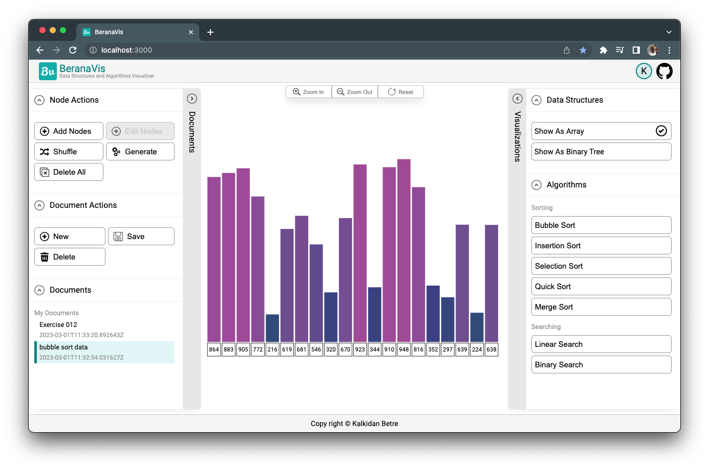

[![Contributors][contributors-shield]][contributors-url]
[![Forks][forks-shield]][forks-url]
[![Stargazers][stars-shield]][stars-url]
[![Issues][issues-shield]][issues-url]
[![MIT License][license-shield]][license-url]
[![LinkedIn][linkedin-shield]][linkedin-url]

<br />
<div align="center">
  <a href="https://github.com/kalibetre/berana-viz-api">
    
  </a>

  <h3 align="center">BeranaViz API</h3></h3>

  <p align="center">
    A data structures and algorithms visualizer - Backend A
    <br />
    <br />
    <br />
    <a href="https://beranaviz.netlify.app/">View Demo</a>
    ·
    <a href="https://github.com/kalibetre/berana-viz-api/issues">Report Bug</a>
    ·
    <a href="https://github.com/kalibetre/berana-viz-api/issues">Request Feature</a>
  </p>
</div>

## About The Project



BeranaViz is a data structures and algorithms visualization that can help you quickly learn data structures and algorithms concepts through animation that you can control. This app allows you to see every step made by a search or sorting algorithm.

In addition, you can also save your documents by creating an account so that you wont lose your data.

### Built With

[![Django][django]][django-url]

This part of the project, which is the backend API, is built with Django and utilizes the Django REST Framework library.

## Getting Started

You can directly start using the app by heading over to [beranaviz](http://beranaviz.netlify.app). However, if you want to run the app locally you can follow the instructions below. Note that, this is only the API part of the whole full stack app. Hence, the front end must be run together for a full experience.

### Installation

1. Clone the repo
    ```sh
    git clone https://github.com/kalibetre/berana-viz-api.git
    ```
2. Create a virtual environment (this project was setup using pipenv)
    ```sh
    pip install pipenv
    ```
3. Install packages by navigating to the root folder
    ```sh
    pipenv install
    ```
4. Setup Environment variables
    ```sh
    SECRET_KEY=
    DB_NAME=
    DB_HOST=
    DB_PORT=
    DB_USER=
    DB_PWD=
    DEBUG=
    ALLOWED_HOSTS=
    ALLOWED_ORIGINS=
    GOOGLE_SERVICE_KEY=
    ```
5. Setup MySQL and create a user and database. These should be updated in the environment variables
6. Make migrations and migrate to the database
    ```sh
    python manage.py makemigrations
    python manage.py migrate
    ```
7. Start the project
    ```sh
    python manage.py runserver
    ```

## Roadmap

-   [ ] Add a blog feature to provide users help with data structure and algorithms concepts
-   [ ] Switch token authentication from firebase to django rest framework auth
-   [ ] Prepare a full app documentation for contributors

See the [open issues](https://github.com/kalibetre/berana-viz-api/issues) for a full list of proposed features (and known issues).

## Contributing

Contributions are what make the open source community such an amazing place to learn, inspire, and create. Any contributions you make are **greatly appreciated**.

If you have a suggestion that would make this better, please fork the repo and create a pull request. You can also simply open an issue with the tag "enhancement".
Don't forget to give the project a star! Thanks again!

1. Fork the Project
2. Create your Feature Branch (`git checkout -b feature/AmazingFeature`)
3. Commit your Changes (`git commit -m 'Add some AmazingFeature'`)
4. Push to the Branch (`git push origin feature/AmazingFeature`)
5. Open a Pull Request

## License

Distributed under the MIT License. See `LICENSE.txt` for more information.

## Contact

Kalkidan Betre - [@kalibetre](https://twitter.com/kalibetre) - kalbetre@icloud.com

Project Link: [https://github.com/kalibetre/berana-viz-api](https://github.com/kalibetre/berana-viz)

[contributors-shield]: https://img.shields.io/github/contributors/kalibetre/berana-viz-api.svg?style=for-the-badge
[contributors-url]: https://github.com/kalibetre/berana-viz-api/graphs/contributors
[forks-shield]: https://img.shields.io/github/forks/kalibetre/berana-viz-api.svg?style=for-the-badge
[forks-url]: https://github.com/kalibetre/berana-viz-api/forks
[stars-shield]: https://img.shields.io/github/stars/kalibetre/berana-viz-api.svg?style=for-the-badge
[stars-url]: https://github.com/kalibetre/berana-viz-api/stargazers
[issues-shield]: https://img.shields.io/github/issues/kalibetre/berana-viz-api.svg?style=for-the-badge
[issues-url]: https://github.com/kalibetre/berana-viz-api/issues
[license-shield]: https://img.shields.io/github/license/kalibetre/berana-viz-api.svg?style=for-the-badge
[license-url]: https://github.com/kalibetre/berana-viz-api/blob/main/LICENSE
[linkedin-shield]: https://img.shields.io/badge/-LinkedIn-black.svg?style=for-the-badge&logo=linkedin&colorB=555
[linkedin-url]: https://www.linkedin.com/in/kalkidan-betre-405750110
[product-screenshot]: images/screenshot.png
[django]: https://img.shields.io/badge/Django-092E20?style=for-the-badge&logo=django&logoColor=white
[django-url]: https://www.djangoproject.com/
